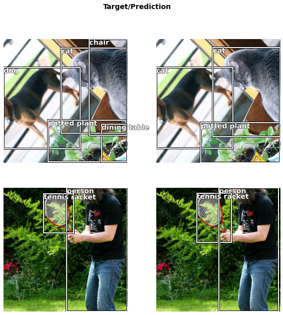
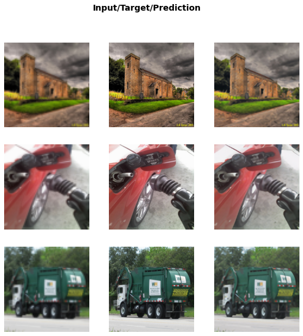

# Welcome to fastpapers
> Play LEGO with papers.


`fastpapers` is a python library where I use [fastai](https://docs.fast.ai/) to reproduce papers on [Jupyter Notebooks](https://jupyter.org/). I use [nbdev](https://nbdev.fast.ai/) to turn these notebooks into modules.

## Install

`pip install fastpapers`

## How to use

### Train DETR in 3 lines of code

Download the data

```python
#slow
path = download_coco(force_download=False)
```

Create the DataLoaders, the Learner, and fit.

```python
#slow
dls = CocoDataLoaders.from_sources(path, vocab=coco_vocab, num_workers=0)
learnd = detr_learner(dls)
learnd.fit(1, lr=[1e-5, 1e-5, 1e-5])
```


<table border="1" class="dataframe">
  <thead>
    <tr style="text-align: left;">
      <th>epoch</th>
      <th>train_loss</th>
      <th>valid_loss</th>
      <th>AP</th>
      <th>AP50</th>
      <th>AP75</th>
      <th>AP_small</th>
      <th>AP_medium</th>
      <th>AP_large</th>
      <th>AR1</th>
      <th>AR10</th>
      <th>AR100</th>
      <th>AR_small</th>
      <th>AR_medium</th>
      <th>AR_large</th>
      <th>time</th>
    </tr>
  </thead>
  <tbody>
    <tr>
      <td>0</td>
      <td>5.892842</td>
      <td>7.636298</td>
      <td>0.475381</td>
      <td>0.574125</td>
      <td>0.506063</td>
      <td>0.297741</td>
      <td>0.458006</td>
      <td>0.560994</td>
      <td>0.355018</td>
      <td>0.545646</td>
      <td>0.560374</td>
      <td>0.375141</td>
      <td>0.541728</td>
      <td>0.630330</td>
      <td>2:05:24</td>
    </tr>
  </tbody>
</table>


Show the results

```python
#slow
with learnd.removed_cbs(learnd.coco_eval): learnd.show_results(max_n=8, figsize=(10,10))
```





### Superresolution in 4 lines of code

Download the data

```python
#slow
path = untar_data(URLs.IMAGENETTE)
```

Create the DataLoaders, the Learner adn fit.

```python
#hide_output
#slow
db = DataBlock(blocks=(ResImageBlock(72), ResImageBlock(288)),
               get_items=get_image_files,
               batch_tfms=Normalize.from_stats([0.5]*3, [0.5]*3))
dls = db.dataloaders(path, bs=4, num_workers=4)
learn = superres_learner(dls)
learn.fit(16, lr=1e-3, wd=0)
```

```python
#slow
learn.show_results()
```





### Library structure

The name of each module is the [bibtexkey](https://en.wikipedia.org/wiki/BibTeX#Field_types) of the corresponing paper.
For example, if you want to use the FID metric from [Heusel, Martin, et al. 2017](http://papers.nips.cc/paper/7240-gans-trained-by-a-two-t), you can import it like so:

```python
from fastpapers.heusel2017gans import FIDMetric
```

If you want to train a pix2pix model from Isola, [Phillip, et al](https://openaccess.thecvf.com/content_cvpr_2017/papers/Isola_Image-To-Image_Translation_With_CVPR_2017_paper.pdf) you can import a pix2pix_learner

```python
from fastpapers.isola2017image import pix2pix_learner
```

The `core` module contains functions and classes that are useful for several papers.
For example, you have a `ImageNTuple` to work with an arbitrary amount of images as input.

```python
path = untar_data(URLs.PETS)
files = get_image_files(path/"images")
```

```python
it = ImageNTuple.create((files[0], files[1], files[2]))
it = Resize(224)(it)
it = ToTensor()(it)
it.show();
```


Or useful functions for debuging like `explode_shapes` or `explode_ranges`

```python
explode_shapes(it)
```


    [(3, 224, 224), (3, 224, 224), (3, 224, 224)]


